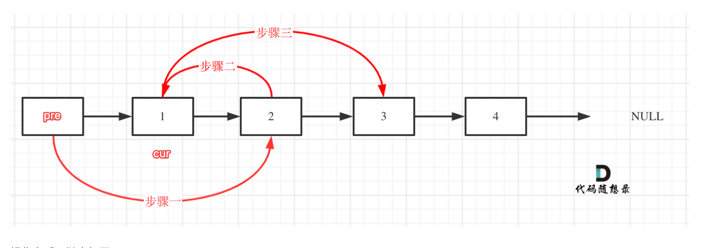
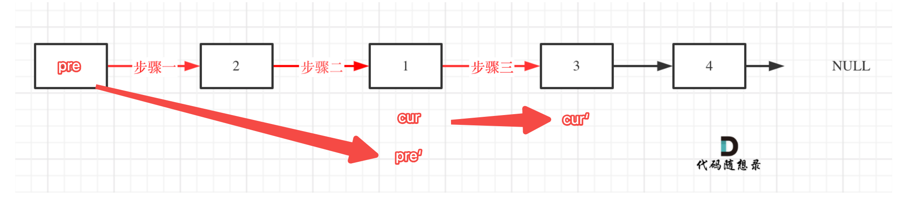
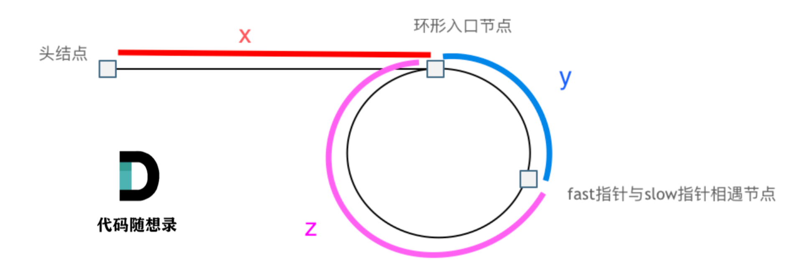

### 24.两两交换链表中的节点
```go
func swapPairs(head *ListNode) *ListNode {
    dummy := &ListNode{Next:head}
    pre := dummy
    cur := head
    for cur != nil && cur.Next!= nil{
        //看图1
        pre.Next = cur.Next
        tmp := cur.Next.Next
        cur.Next.Next = cur
        cur.Next = tmp
        //看图2
        pre = cur
        cur = tmp
    }
    return dummy.Next
}
```
这道题流程一定要想明白，两辆交换前的图要画，根据交换顺序写地址赋值部分就能写出来；交换完成后也需要画图画出来，根据pre和cur的接点才能正确更新到下一个循坏的启始位置。



### 19.删除链表的倒数第N个节点
```go
func removeNthFromEnd(head *ListNode, n int) *ListNode {
    dummy := &ListNode{Next:head}
    fast, slow := dummy,dummy
    for i:=0; i<n; i++{
        fast = fast.Next
    }
    fast = fast.Next
    for fast != nil{
        fast = fast.Next
        slow = slow.Next
    }
    if slow.Next != nil{
        slow.Next = slow.Next.Next
    }
    return dummy.Next
}
```
这一题如何找到倒数第N个节点的思路很重要。可以定义fast slow指针，先让fast走N步，再一起走直到fast为nil时，此时slow指针所在位置即需要删除的节点。那为了删除该节点，slow应当在该节点之前，所以fast需要提前走N+1步。

### 160.链表相交
```go
func getIntersectionNode(headA, headB *ListNode) *ListNode {
    if headA == nil || headB == nil{
        return nil
    }
    h1,h2 := headA,headB
    for headA != headB{
        if headA == nil{
            headA = h2
        } else {
            headA = headA.Next
        }
        if headB == nil{
            headB = h1
        } else {
            headB = headB.Next
        }
    }
    return headA
}
```
思路很重要的点在于，知道A B链表分别走到底后，再走对方相交节点前的路总链表长度是一致的，必定会相遇。而我卡住的点在于循环条件，因为认为若链表不相交岂不是要无限循环走？实际上设置为A ！=B就可以了，同时为nil时循环自然会终止

### 142.环形链表II
```go
func detectCycle(head *ListNode) *ListNode {
    fast,slow := head,head
    for fast != nil && fast.Next != nil{
        fast = fast.Next.Next
        slow = slow.Next
        if fast == slow{
            for head != slow{
                head = head.Next
                slow = slow.Next
            }
            return slow
        }
    }
    return nil
}
```
记住这个结论吧，**x=z**，快慢指针相遇后的点与链表头共同出发相遇时即为入环点
